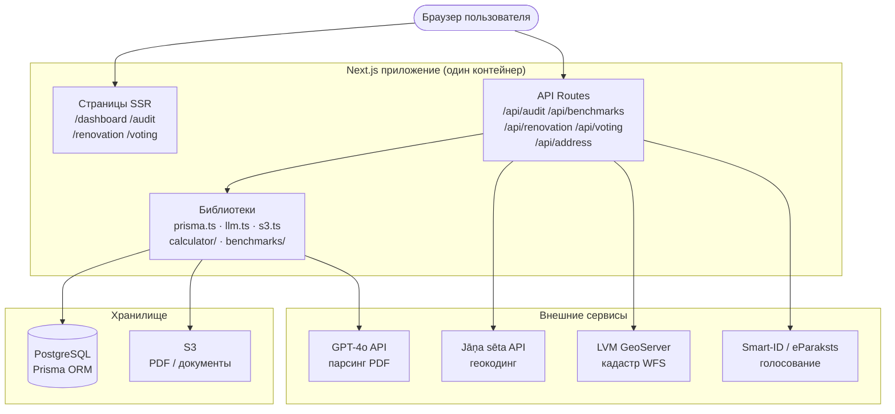
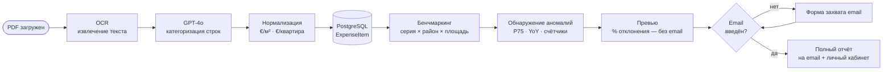
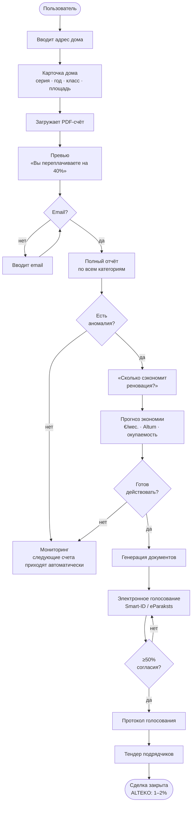
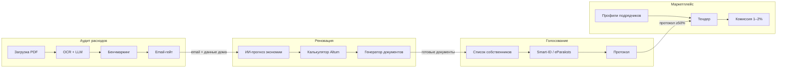
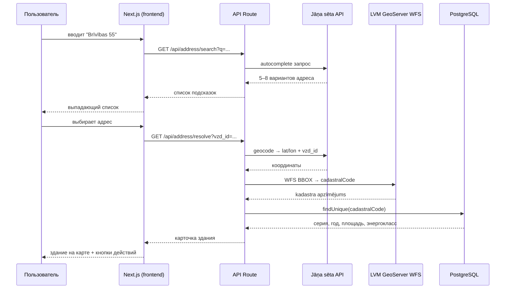
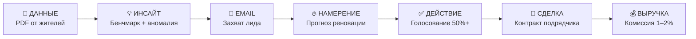

# Диаграммы ALTEKO

Визуализация архитектуры, потоков данных и пользовательских сценариев.
Все диаграммы построены строго по документации — ничего не выдумано.

---

## 1. Архитектура системы

Один Docker-контейнер с Next.js обслуживает и frontend, и backend. Отдельного сервера нет.

---

## 2. Поток обработки PDF-счёта

От загрузки файла до результата в двух форматах: превью (мгновенно) и полный отчёт (после email).

---

## 3. Путь пользователя (User Flow)

Три эмоциональных этапа с email-гейтом между превью и полным отчётом.

---

## 4. Взаимодействие модулей

Как четыре модуля связаны между собой и что передают друг другу.

---

## 5. Поиск адреса и связь с кадастром

Цепочка из четырёх шагов от строки ввода до данных здания.

---

## 6. Цепочка ценности

Как данные превращаются в выручку.

---

*Все диаграммы основаны на: architecture.md, module-audit.md, module-renovation.md, address-search.md, monetization.md, concept.md*
